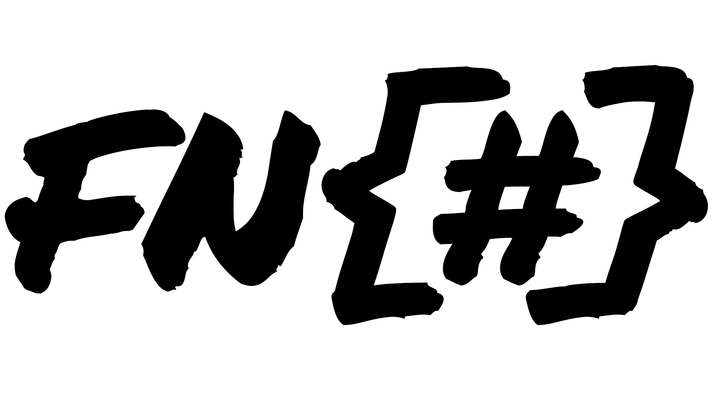
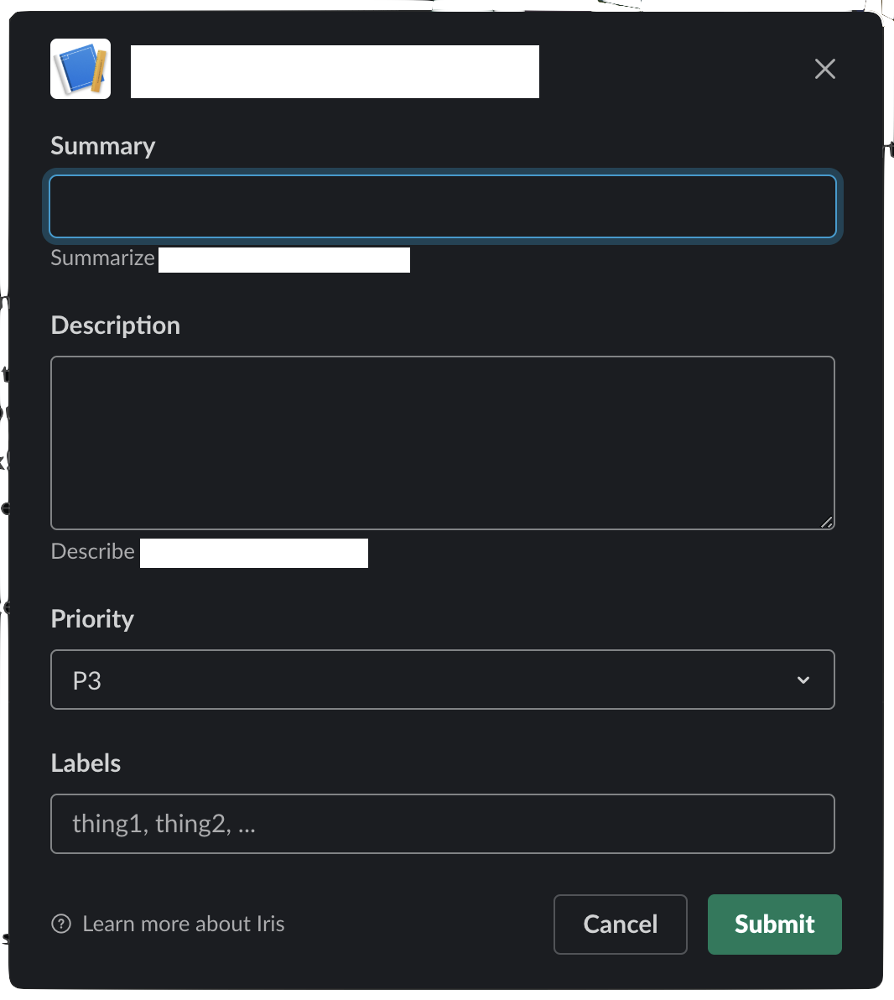

<!--  -->

<p align="center">
  
</p>


# BlockBox

A tool used to generate slack UI blocks using elixir defined functions.

## Motivation

* Slack blocks are large
  - As seen in the example below, the json payload is about 2 times larger than the functional definition
* Reusability
  - Repetition of blocks is reduced across code, the same functions are used and can be changed in a single place
* Readability
  - It's easier to read functions with parameters instead of large scoped blocks 

## Installation

```elixir
def deps do
  [
    {:blockbox, "~> 1.0.0"}
  ]
end
```

## Usage
`use BlockBox` in whatever module you need it to get access to all the components.
```
  use BlockBox
```

## Example

The following Slack UI view

<!--  -->


has the elixir structure shown below (it is assumed that atoms will be converted to strings using whatever JSON encoding library you're using)

```
[
  %{type: "divider"},
  %{
    block_id: "summary",
    element: %{action_id: "sum_input", type: "plain_text_input"},
    label: %{text: "Summary", type: :plain_text},
    type: "input"
  },
  %{elements: [%{text: "Summarize ...", type: :mrkdwn}], type: "context"},
  %{
    block_id: "description",
    element: %{
      action_id: "desc_input",
      multiline: true,
      placeholder: %{text: "Write something", type: :plain_text},
      type: "plain_text_input"
    },
    label: %{text: "Description", type: :plain_text},
    type: "input"
  },
  %{elements: [%{text: "Describe ...", type: :mrkdwn}], type: "context"},
  %{
    block_id: "priority",
    element: %{
      action_id: "priority_input",
      options: [
        %{text: %{text: "P1", type: :plain_text}, value: "6"},
        %{text: %{text: "P2", type: :plain_text}, value: "7"},
        %{text: %{text: "P3", type: :plain_text}, value: "8"},
        %{text: %{text: "P4", type: :plain_text}, value: "9"}
      ],
      placeholder: %{text: "Select items", type: :plain_text},
      type: :static_select
    },
    label: %{text: "Priority", type: :plain_text},
    type: "input"
  },
  %{
    block_id: "labels",
    element: %{
      action_id: "label_input",
      multiline: true,
      placeholder: %{text: "thing1, thing2, ...", type: :plain_text},
      type: "plain_text_input"
    },
    label: %{text: "Labels", type: :plain_text},
    type: "input"
  }
]
```

using BlockBox the structure can be simplified to 

```
[
  divider(),
  input("Summary", plain_text_input("sum_input"), block_id: "summary"),
  context_block([text_object("Summarize ...", :mrkdwn)]),
  input(
    "Description",
    plain_text_input("desc_input", multiline: true, placeholder: "Write something"),
    block_id: "description"
  ),
  context_block([text_object("Describe ...", :mrkdwn)]),
  input(
    "Priority",
    select_menu("Select items", :static_select, "priority_input",
      options: Enum.map(1..4, fn x -> option_object("P#{x}", "#{x + 5}") end)
    ),
    block_id: "priority"
  ),
  input(
    "Labels",
    plain_text_input("label_input", multiline: true, placeholder: "thing1, thing2, ..."),
    block_id: "labels"
  )
]
```
